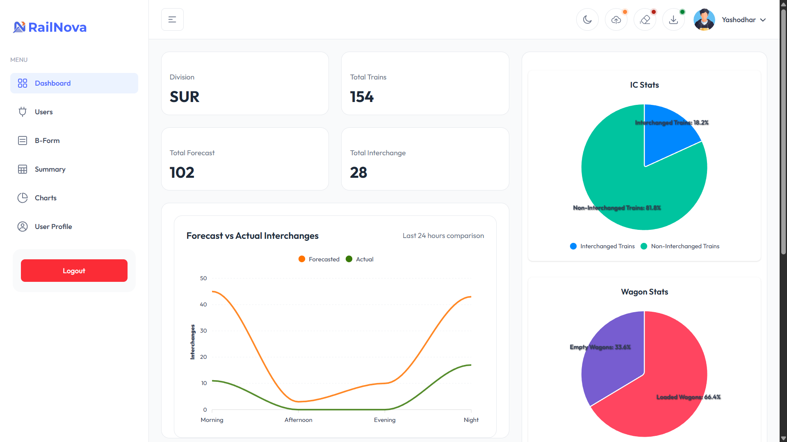

# 🚆 RailNova – Railway Operations Analytics & B-Form Automation

**RailNova** is a full-stack web application developed during industrial training to digitize, analyze, and visualize **Indian Railways B-Form and freight operation data**.
The system transforms raw, unformatted Excel data from FOIS into structured tables, interactive dashboards, summaries, and charts—while preserving manual corrections made by railway officers across repeated imports.

🔗 **Live Demo:** [https://rail-nova.vercel.app](https://rail-nova.vercel.app)



---

## 🚀 Quick Start: Clone the Repository

To get started with RailNova locally:

```bash
# Clone via HTTPS
git clone https://github.com/YashodharChavan/RailNova.git

# change directory
cd RailNova

# goto frontend folder to run below commands:
npm install
npm run dev
```

---

## 📌 Problem Statement

Railway officers rely on **B-Form** documents to track goods train operations, interchange points, wagon status, forecasts, and siding activities.
However:

* FOIS data is provided as **raw Excel files without formatting**
* Critical fields (IC/FC, locomotives, siding info) are inconsistent or incorrect
* Manual corrections are **lost when new data is imported**
* Analysis is slow, manual, and error-prone

RailNova was built to solve these exact problems.

---

## ✨ Key Features

### 🧠 Persistent UserOverrides (Core Feature)

* Officers can correct incorrect FOIS data directly in the UI
* Corrections are stored separately and **persist across multiple Excel imports**
* Prevents loss of manual edits during data refreshes

### 📊 Interactive Dashboard & Analytics

* Real-time charts for:
  * Interchanged vs Non-Interchanged trains
  * Forecasted vs Actual arrivals (time-based)
  * Loaded vs Empty wagons
* Hover-enabled charts for detailed insights

### 📁 B-Form & Summary Views

* Auto-generated:
  * Master Sheet
  * IC / NON-IC Summary
  * Forecasted / Remaining trains
  * Wagon summaries
* Color-coded visualization:
  * 🟢 IC (Interchanged)
  * 🔵 Forecasted
  * ⚪ Remaining

### 🔐 Role-Based Authentication

* Secure JWT-based authentication
* Three user roles:
  * **Admin** – Upload/clear data, manage users
  * **Editor** – Edit operational data
  * **Viewer** – Read-only access
* Protected routes prevent unauthorized access

---

## 🧩 System Architecture

### Frontend

* React + TypeScript
* TailAdmin template (customized and refactored)
* Light & Dark themes
* Role-aware UI rendering
* Charts & dashboards for operational analytics

### Backend

* Node.js + Express
* Supabase (PostgreSQL)
* JWT authentication (HTTP-only cookies)
* Multer + XLSX for Excel ingestion
* NodeCache for performance optimization

---

## 📥 Excel Processing & Automation

* Handles **unformatted FOIS Excel files**
* Splits SRC-DEST and DEST-SRC data correctly
* Detects and processes:
  * Multiple locomotives
  * Siding movements (loading, unloading, waiting)
  * IC / FC flags
* Batch inserts data into route-wise tables
* Automatically reapplies user overrides after each import

---

## 🔐 Security & Data Integrity

* CORS-restricted backend
* Auth-protected APIs
* Role-restricted actions (upload, clear, edit)
* Override reconciliation prevents accidental data loss
* Cached analytical queries for performance

---

## 🧪 Development Context

* Developed during **Industrial Training (Indian Railways – Solapur Division)**
* Built as a **functional prototype** aligned with real railway workflows
* Iterated from an earlier Drive-based B-Form system to a full web platform
* Focused on correctness, usability, and operational realism

---

## 👥 Team & Contribution

**Team Members**

* Yashodhar Chavan
* Yuvraj Gandhmal
* Shruti Gajul
* Prajwal Hulle

**Contribution Highlights**

* Frontend refactor & UI integration
* Core Excel parsing logic
* Dashboard analytics
* **UserOverrides persistence mechanism**
* Backend API design & data processing

---

## 🚀 Outcome

RailNova demonstrates how complex, real-world railway data can be:

* Parsed reliably
* Corrected safely
* Analyzed visually
* Preserved across automation cycles

The project showcases strong **full-stack engineering**, **data integrity design**, and **real-world problem solving** under domain constraints.

---

## 📜 Disclaimer

This project was developed as part of industrial training and serves as a **functional prototype**.
It was not deployed into live railway operations but was built to reflect real-world workflows and data challenges.

---

If you want next, I can:
* Trim this README for **resume-friendly GitHub**
* Create a **short README version** (1-minute read)
* Help you write a **“What I’d improve if deployed”** section (very interview-friendly)
* Align RailNova + B-Form + macOS Tiger into a **strong narrative**

Just tell me 👍